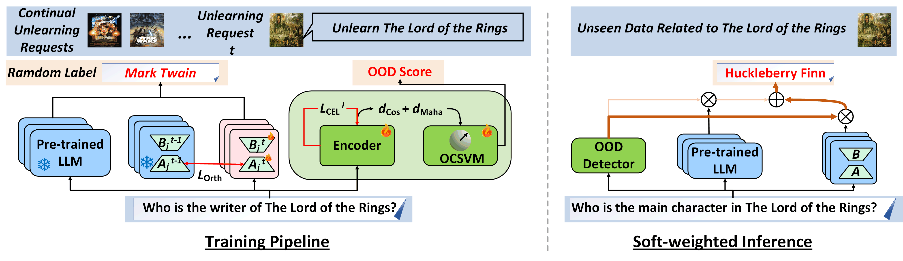

# On Large Language Model Continual Unlearning

This repo covers implementations of O3 framework 
that includes an Orthogonal low-rank adapter (LoRA) for continually unlearning requested data and an Out-Of-Distribution (OOD) detector 
to measure the similarity between input and unlearning data in **[On Large Language Model Continual Unlearning](https://openreview.net/forum?id=Essg9kb4yx)**. 
The paper is accepted to ICLR 2025. 

Parts of our code are inspired by the implementations of [SOUL](https://github.com/OPTML-Group/SOUL) and [ScienceQA](https://github.com/lupantech/ScienceQA) project. We thank the authors of these repositories for their valuable work. 

We provided the code for ScienceQA experiments and an initial version of our code on TOFU
- [x] `ScienceQA_experiment`
- [x] `TOFU_experiment`

We will upload the clear version of the code. 

